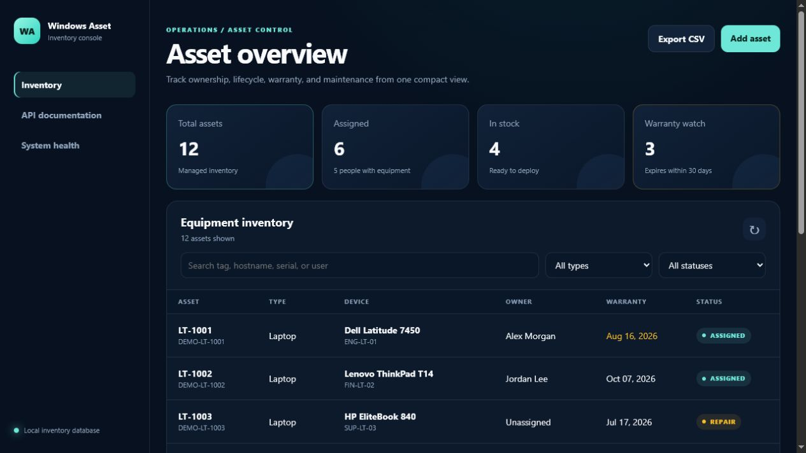
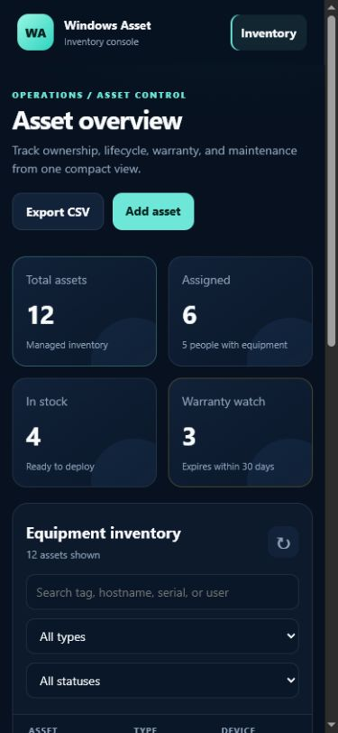
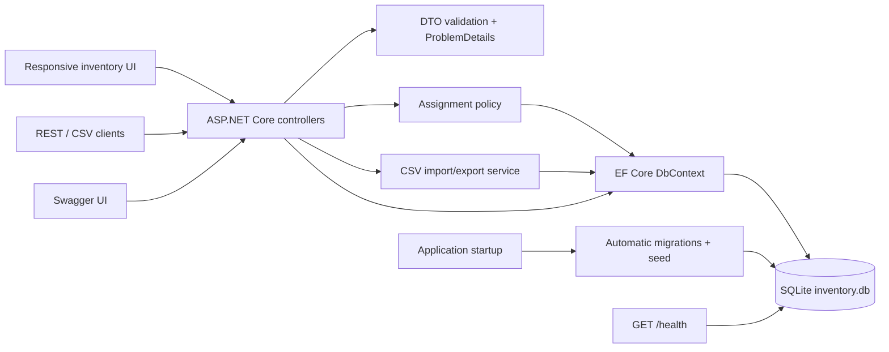
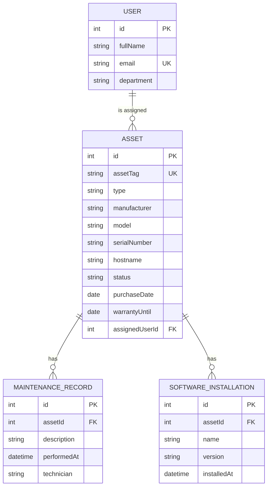

# Windows Asset Inventory

[](https://github.com/German4341374/windows-asset-inventory/actions/workflows/ci.yml)
[](https://dotnet.microsoft.com/)
[](LICENSE)

Keep an inventory of computers, monitors, and other office equipment.
Assign devices to people, record repairs and installed software, and check which warranties
are about to end.

The web interface and REST API use the same SQLite database. You can run the ASP.NET Core
app on your computer or start it with Docker.

## Features

- CRUD APIs for assets, users, and maintenance records.
- Safe assignment and return workflow with conflict protection.
- Search by asset tag, hostname, serial number, or assigned user.
- Filters for asset type and lifecycle status.
- Warranty-expiration list with a configurable time window.
- Installed-software records scoped to individual assets.
- Validated CSV import and standards-compliant CSV export.
- Dashboard totals for status, asset type, users, and warranty risk.
- DTO-only API responses; EF Core entities do not cross the API boundary.
- RFC 7807 Problem Details for validation, conflicts, missing resources, and server errors.
- Automatic EF Core migrations and deterministic demonstration seed data.
- Swagger UI, database-aware health check, and a responsive HTML/CSS/JavaScript interface.
- Non-root multi-stage Docker image with persistent SQLite storage.

## Screenshots





The screenshots contain only fictional demonstration records from the built-in seed.

## Architecture



The application follows a practical layered structure:

```text
Controllers/   HTTP routes, query handling, and response codes
Contracts/     request and response DTOs
Models/        persistence entities and enums
Services/      assignment rules, CSV processing, health, and exception handling
Data/          EF Core context, migrations, path handling, and seed
wwwroot/       responsive dashboard
tests/         xUnit unit and WebApplicationFactory integration tests
```

See [the architecture notes](docs/architecture.md) for design decisions and trade-offs.

## Entity Relationship Diagram



## Prerequisites

- [.NET SDK 10.0.302](https://dotnet.microsoft.com/en-us/download/dotnet/10.0) or a
  compatible .NET 10 patch SDK.
- Git.
- Optional: Docker Desktop with WSL2 or Docker Engine with Compose.
- Optional: GNU Make. Every Make target maps to a documented `dotnet` or Docker command.

.NET 10 is an active Long Term Support release. The repository uses `global.json` and pinned
NuGet dependencies for reproducible builds.

## Local Setup

```bash
git clone https://github.com/German4341374/windows-asset-inventory.git
cd windows-asset-inventory
dotnet tool restore
dotnet restore WindowsAssetInventory.sln --locked-mode
dotnet run --project src/WindowsAssetInventory
```

Open:

- Dashboard: <http://localhost:5000> or the URL printed by `dotnet run`
- Swagger UI: <http://localhost:5000/swagger>
- Health check: <http://localhost:5000/health>

The application creates `src/WindowsAssetInventory/App_Data/inventory.db`, applies pending migrations,
and inserts demonstration data when the asset table is empty. The database is ignored by Git.

Use an explicit URL when scripting:

```bash
ASPNETCORE_URLS=http://localhost:8080 \
  dotnet run --project src/WindowsAssetInventory
```

PowerShell:

```powershell
$env:ASPNETCORE_URLS = "http://localhost:8080"
dotnet run --project src/WindowsAssetInventory
```

## Docker Setup

```bash
docker compose up --build --detach
docker compose ps
curl http://localhost:8080/health
```

Open <http://localhost:8080>. SQLite data is stored in the named `inventory-data` volume.
The container:

- runs as the pre-defined non-root `app` user;
- drops Linux capabilities;
- enables `no-new-privileges`;
- uses a read-only root filesystem;
- writes only to `/app/data` and `/tmp`;
- has an application-aware health check.

Stop without deleting data:

```bash
docker compose down
```

Delete containers and the local demonstration database:

```bash
docker compose down --volumes
```

## API

| Route | Methods | Purpose |
| --- | --- | --- |
| `/api/assets` | GET, POST | Search/filter or create assets |
| `/api/assets/{id}` | GET, PUT, DELETE | Asset CRUD |
| `/api/assets/{id}/assign` | POST | Assign an available asset |
| `/api/assets/{id}/return` | POST | Return an assigned asset |
| `/api/assets/warranty-expiring` | GET | Upcoming warranty expirations |
| `/api/assets/import-csv` | POST | Import up to 500 CSV rows |
| `/api/assets/export-csv` | GET | Export the current asset list |
| `/api/assets/{id}/software` | GET, POST | List or add installed software |
| `/api/users` | GET, POST | Search or create users |
| `/api/users/{id}` | GET, PUT, DELETE | User CRUD |
| `/api/maintenance` | GET, POST | List or create maintenance records |
| `/api/maintenance/{id}` | GET, PUT, DELETE | Maintenance CRUD |
| `/api/dashboard` | GET | Aggregated inventory statistics |
| `/health` | GET | Application and SQLite health |

### Create an asset

```bash
curl -X POST http://localhost:8080/api/assets \
  -H "Content-Type: application/json" \
  -d '{
    "assetTag": "LT-1042",
    "type": "Laptop",
    "manufacturer": "Framework",
    "model": "Laptop 13",
    "serialNumber": "DEMO-SERIAL-1042",
    "hostname": "OPS-LT-42",
    "status": "In Stock",
    "purchaseDate": "2026-05-12",
    "warrantyUntil": "2029-05-12"
  }'
```

### Search and filter

```bash
curl "http://localhost:8080/api/assets?search=Alex&type=Laptop&status=Assigned"
curl "http://localhost:8080/api/assets/warranty-expiring?days=45"
```

### Assign and return

```bash
curl -X POST http://localhost:8080/api/assets/6/assign \
  -H "Content-Type: application/json" \
  -d '{"userId":4}'

curl -X POST http://localhost:8080/api/assets/6/return
```

Attempting to assign an occupied, retired, or repair asset returns HTTP `409` with Problem Details.

### CSV

```bash
curl -X POST http://localhost:8080/api/assets/import-csv \
  -F "file=@sample-assets.csv"

curl -OJ http://localhost:8080/api/assets/export-csv
```

Dates use `yyyy-MM-dd`. Required columns are `AssetTag`, `Type`, `Manufacturer`, `Model`,
`SerialNumber`, and `Status`. See [CSV operations](docs/csv.md).

## Testing

```bash
dotnet format WindowsAssetInventory.sln --verify-no-changes
dotnet build WindowsAssetInventory.sln --configuration Release
dotnet test WindowsAssetInventory.sln --configuration Release
dotnet list WindowsAssetInventory.sln package --vulnerable --include-transitive
```

The test suite includes:

- unit tests for assignment, reassignment prevention, return, repair, and retirement rules;
- integration tests that boot the complete application with `WebApplicationFactory`;
- real temporary SQLite migrations and seed;
- health, validation, Problem Details, search, dashboard, warranty, CSV, and maintenance tests.

Convenience commands:

```bash
make setup
make format-check
make build
make test
make run
make up
make down
```

## Database and Migrations

Create a migration after changing entity mappings:

```bash
dotnet tool restore
dotnet tool run dotnet-ef migrations add DescribeChange \
  --project src/WindowsAssetInventory \
  --startup-project src/WindowsAssetInventory \
  --output-dir Data/Migrations
```

Inspect the SQL before committing:

```bash
dotnet tool run dotnet-ef migrations script \
  --project src/WindowsAssetInventory \
  --startup-project src/WindowsAssetInventory
```

Startup automatically applies committed migrations. Back up the SQLite database before upgrading
a real deployment.

## Security Considerations

- The project deliberately has no authentication. Do not expose it to an untrusted network.
- Place it behind an authenticated reverse proxy before using real company inventory data.
- CSV uploads are limited to 2 MiB and 500 records, but uploaded content is still trusted
  administrative input.
- SQLite is suitable for a single small deployment, not concurrent multi-instance writes.
- Swagger is enabled in every environment for demonstration. Restrict or disable it in a real
  production environment.
- The seed contains fictional names, `example.test` email addresses, and demonstration serials.
- Database files, build output, test results, and local environment files are ignored by Git.

## Limitations

- No authentication, authorization, audit identity, or role model.
- No barcode scanner, attachment storage, procurement integration, or notifications.
- No soft-delete workflow or immutable audit log.
- No full-text search; the current search is appropriate for a small SQLite inventory.
- Automatic startup migrations are convenient for one instance but larger deployments should use
  a controlled migration job.

## Possible next steps

- Add OpenID Connect and role-based authorization.
- Add assignment history and immutable audit events.
- Generate printable asset labels and QR codes.
- Add warranty reminder notifications.
- Move to PostgreSQL for larger multi-user deployments.
- Add pagination and full-text search.

## License

Licensed under the [MIT License](LICENSE).
